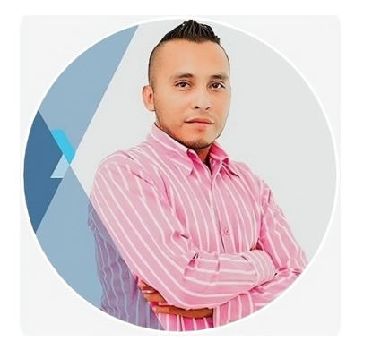

<!DOCTYPE html>
<html lang="es">
<head>
    <meta charset="UTF-8">
    <meta name="viewport" content="width=device-width, initial-scale=1.0">
    <title>Ing. Software - Sistema Gestión Veterinaria</title>
    <link href="https://cdn.jsdelivr.net/npm/bootstrap@5.3.2/dist/css/bootstrap.min.css" rel="stylesheet">
    <link rel="stylesheet" href="https://cdn.jsdelivr.net/npm/bootstrap-icons@1.11.1/font/bootstrap-icons.css">
    
</head>
<body>
    <!-- Navbar -->
    <nav class="navbar navbar-expand-lg navbar-dark navbar-custom fixed-top">
        

            <a class="navbar-brand fw-bold" href="#">
                <i class="bi bi-code-slash me-2"></i>Ing. Software Freelance 
            </a>
            

                <a class="nav-link" href="https://wa.me/525654255366" target="_blank">
                    <i class="bi bi-whatsapp me-1"></i>WhatsApp
                </a>
            

        

    </nav>

    <!-- Hero Section -->
    <section class="hero-section">
        

            

                

                    <h1 class="display-4 fw-bold mb-4">Desarrollo de Software </h1>
                    
Ingeniero de Software Freelance - Soluciones personalizadas y eficientes

                    

                        PHP/MySQL
                        JavaScript
                        Bootstrap 5
                        Desarrollo Full-Stack
                    

                    <a href="https://wa.me/525654255366" class="btn btn-light btn-lg">
                        <i class="bi bi-calendar-check me-2"></i>Solicitar Cotización
                    </a>
                

                

                    
                    <h4 class="mt-3">Jose Luis Rodriguez</h4>
                    
Ingeniero de Software

                    

                        <i class="bi bi-star-fill"></i>
                        <i class="bi bi-star-fill"></i>
                        <i class="bi bi-star-fill"></i>
                        <i class="bi bi-star-fill"></i>
                        
                    

                

            

        

    </section>

    <!-- Services Section -->
    <section class="py-5 mt-5">
        

            <h2 class="section-title">Servicios de Desarrollo</h2>
            
Soluciones completas para automatizar y optimizar tu negocios

            
            

                <!-- Servicio Básico -->
                

                    

                        

                            <h4>Plan Básico</h4>
                            
$14,000

                            
Pago único • 1-2 semanas

                        

                        

                            <ul class="feature-list">
                                <li><i class="bi bi-check-circle"></i> Sistema de agendamiento básico</li>
                                <li><i class="bi bi-check-circle"></i> Panel administrativo simple</li>
                                <li><i class="bi bi-check-circle"></i> Gestión de clientes y productos</li>
                                <li><i class="bi bi-check-circle"></i> Diseño responsive</li>
                                <li><i class="bi bi-check-circle"></i> Base de datos MySQL</li>
                                <li><i class="bi bi-clock"></i> <strong>Entrega: 1-2 semanas</strong></li>
                                <li><i class="bi bi-headset"></i> Soporte técnico: 30 días</li>
                            </ul>
                            

                                <a href="https://wa.me/525654255366?text=Me interesa el Plan Básico de $14,000 MXN" 
                                   class="btn btn-outline-primary w-100" target="_blank">
                                    <i class="bi bi-whatsapp me-2"></i>Solicitar
                                </a>
                            

                        

                    

                

                <!-- Servicio Estándar (Recomendado) -->
                

                    

                        
MÁS SOLICITADO

                        

                            <h4>Plan Estándar</h4>
                            
$31,000

                            
Pago único • 3-4 semanas

                        

                        

                            <ul class="feature-list">
                                <li><i class="bi bi-check-circle"></i> <strong>Sistema completo de gestión</strong></li>
                                <li><i class="bi bi-check-circle"></i> Roles: Cliente y Administrador</li>
                                <li><i class="bi bi-check-circle"></i> Reprogramación y cancelación</li>
                                <li><i class="bi bi-check-circle"></i> Historial médico completo</li>
                                <li><i class="bi bi-check-circle"></i> Validación de horarios</li>
                                <li><i class="bi bi-check-circle"></i> Control de días festivos</li>
                                <li><i class="bi bi-clock"></i> <strong>Entrega: 3-4 semanas</strong></li>
                                <li><i class="bi bi-headset"></i> <strong>Soporte: 60 días incluido</strong></li>
                            </ul>
                            

                                <a href="https://wa.me/525654255366?text=Me interesa el Plan Estándar de $31,000 MXN" 
                                   class="btn btn-primary-custom w-100" target="_blank">
                                    <i class="bi bi-whatsapp me-2"></i>Cotizar Ahora
                                </a>
                            

                        

                    

                

                <!-- Servicio Premium -->
                

                    

                        

                            <h4>Plan Premium</h4>
                            
$52,000

                            
Pago único • 5-6 semanas

                        

                        

                            <ul class="feature-list">
                                <li><i class="bi bi-check-circle"></i> Todo el plan Estándar +</li>
                                <li><i class="bi bi-check-circle"></i> Recordatorios automáticos</li>
                                <li><i class="bi bi-check-circle"></i> Integración WhatsApp/Email</li>
                                <li><i class="bi bi-check-circle"></i> App móvil básica</li>
                                <li><i class="bi bi-check-circle"></i> Reportes avanzados</li>
                                <li><i class="bi bi-check-circle"></i> Dashboard analítico</li>
                                <li><i class="bi bi-clock"></i> <strong>Entrega: 5-6 semanas</strong></li>
                                <li><i class="bi bi-headset"></i> Soporte: 90 días incluido</li>
                            </ul>
                            

                                <a href="https://wa.me/525654255366?text=Me interesa el Plan Premium de $52,000 MXN" 
                                   class="btn btn-outline-primary w-100" target="_blank">
                                    <i class="bi bi-whatsapp me-2"></i>Solicitar
                                </a>
                            

                        

                    

                

            

        

    </section>

    <!-- ROI Section -->
    <section class="py-5 bg-light">
        

            <h2 class="section-title">Inversión Inteligente con ROI Garantizado</h2>
            

                

                    

                        

                            <i class="bi bi-clock"></i>
                        

                        <h5>Ahorro de Tiempo</h5>
                        
Automatización de procesos administrativos

                        <h4 class="text-success">$5,000 - $7,000 MXN/mes</h4>
                    

                

                

                    

                        

                            <i class="bi bi-calendar-x"></i>
                        

                        <h5>Optimización de Citas</h5>
                        
Reducción de citas perdidas y mejor organización

                        <h4 class="text-success">$3,500 - $8,600 MXN/mes</h4>
                    

                

                

                    

                        

                            <i class="bi bi-graph-up"></i>
                        

                        <h5>Eficiencia Operativa</h5>
                        
Mejora en la gestión y atención al cliente

                        <h4 class="text-success">$2,600 - $4,300 MXN/mes</h4>
                    

                

            

            

                

                    <h4 class="mb-2">ROI Total Estimado: $11,100 - $19,900 MXN/mes</h4>
                    
¡Tu inversión se recupera en 2-4 meses!

                

            

        

    </section>

    <!-- Tech Stack -->
    <section class="py-5">
        

            <h2 class="section-title">Tecnologías y Metodología</h2>
            

                

                    

                        <i class="bi bi-filetype-php tech-icon"></i>
                        <h5>PHP 8.x</h5>
                        
Backend robusto y seguro

                    

                    

                        <i class="bi bi-database tech-icon"></i>
                        <h5>MySQL</h5>
                        
Base de datos relacional

                    

                    

                        <i class="bi bi-bootstrap tech-icon"></i>
                        <h5>Bootstrap 5</h5>
                        
Diseño responsive

                    

                    

                        <i class="bi bi-javascript tech-icon"></i>
                        <h5>JavaScript</h5>
                        
Interactividad y validaciones

                    

                

            

        

    </section>

    <!-- Development Process -->
    <section class="py-5 bg-light">
        

            <h2 class="section-title">Proceso de Desarrollo</h2>
            

                

                    
1

                    <h5>Análisis y Planificación</h5>
                    
Reunión inicial para entender tus necesidades y planificar el proyecto

                

                

                    
2

                    <h5>Desarrollo Iterativo</h5>
                    
Desarrollo por módulos con revisiones constantes y feedback

                

                

                    
3

                    <h5>Entrega y Soporte</h5>
                    
Implementación, capacitación y soporte post-entrega

                

            

        

    </section>

    <!-- Payment Plans -->
    <section class="py-5">
        

            <h2 class="section-title">Planes de Pago Flexibles</h2>
            

                

                    

                        <h4>Plan 50/50</h4>
                        
$31,000

                        
<strong>50% inicial:</strong> $15,500 <strong>50% final:</strong> $15,500

                        <small class="text-success fw-bold">Recomendado para proyectos estándar</small>
                    

                

                

                    

                        <h4>Plan 40/30/30</h4>
                        
$31,000

                        
<strong>40% inicial:</strong> $12,400 <strong>30% avance:</strong> $9,300 <strong>30% final:</strong> $9,300

                    

                

                

                    

                        <h4>Personalizado</h4>
                        
Consultar

                        
Planes a 3-6 meses sin intereses Pregunta por nuestras opciones

                        <small class="text-muted">Sujeto a evaluación</small>
                    

                

            

        

    </section>

    <!-- Contact Section -->
    <section id="contacto" class="py-5 bg-light">
        

            

                

                    

                        

                            

                                <h3 class="mb-3">¿Listo para transformar tu negocio?</h3>
                                
Agenda una consulta gratuita para analizar tus necesidades

                                

                                    <a href="https://wa.me/5654255366" class="btn btn-light btn-lg" target="_blank">
                                        <i class="bi bi-whatsapp me-2"></i>WhatsApp
                                    </a>
                                    <a href="mailto:rodriguezeliceriojoseluis@gmail.com" class="btn btn-outline-light btn-lg">
                                        <i class="bi bi-envelope me-2"></i>Email
                                    </a>
                                    <a href="tel:+525654255366" class="btn btn-outline-light btn-lg">
                                        <i class="bi bi-telephone me-2"></i>Llamar
                                    </a>
                                

                            

                            

                                <i class="bi bi-chat-quote" style="font-size: 4rem; opacity: 0.8;"></i>
                            

                        

                    

                

            

        

    </section>

    <!-- FAQ Section -->
    <section class="py-5">
        

            <h2 class="section-title">Preguntas Frecuentes</h2>
            

                

                    

                        

                            <h2 class="accordion-header">
                                <button class="accordion-button" type="button" data-bs-toggle="collapse" data-bs-target="#faq1">
                                    ¿Qué garantías ofrecen?
                                </button>
                            </h2>
                            

                                

                                    60 días de garantía por bugs y errores críticos. Soporte técnico incluido durante el periodo de garantía.
                                

                            

                        

                        

                            <h2 class="accordion-header">
                                <button class="accordion-button collapsed" type="button" data-bs-toggle="collapse" data-bs-target="#faq2">
                                    ¿Incluyen hosting y dominio?
                                </button>
                            </h2>
                            

                                

                                    No incluidos en el precio base. Puedo ayudarte a configurar hosting (aprox. $2,100-3,100 MXN/año) y dominio ($200-260 MXN/año).
                                

                            

                        

                        

                            <h2 class="accordion-header">
                                <button class="accordion-button collapsed" type="button" data-bs-toggle="collapse" data-bs-target="#faq3">
                                    ¿Ofrecen mantenimiento posterior?
                                </button>
                            </h2>
                            

                                

                                    Sí, ofrezco planes de mantenimiento desde $860 MXN/mes para actualizaciones, backups y soporte continuo.
                                

                            

                        

                    

                

            

        

    </section>

    <!-- Footer -->
    <footer class="bg-dark text-white py-4">
        

            
&copy; 2024 Ingeniero de Software Freelance Jose Luis Rodriguez Elicerio. Todos los derechos reservados.

            
Especialista en desarrollo de software

        

    </footer>

    
</body>
</html>
